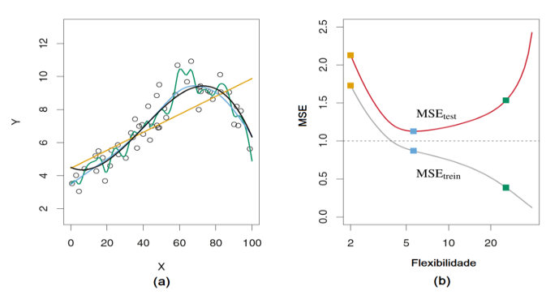
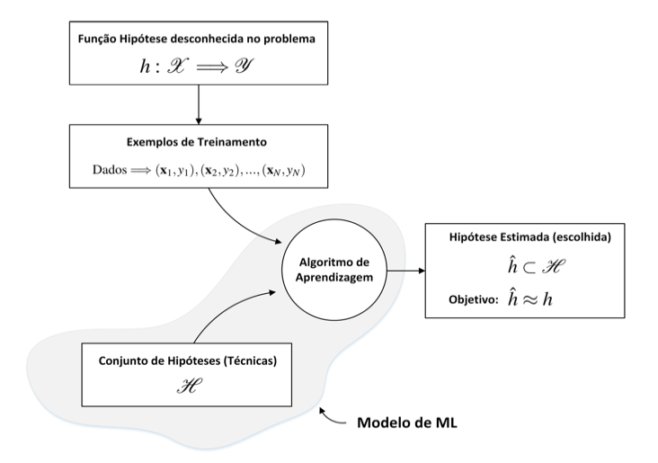
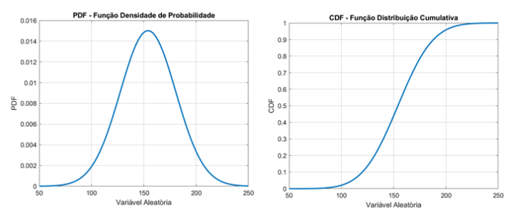
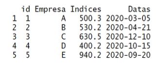
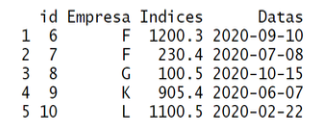
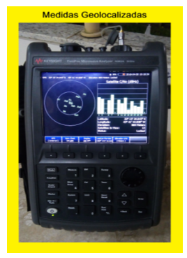

# Atividades

## 1.1 Exercícios Conceituais
  __1. Com suas palavras, forneça uma definição para a aprendizagem de máquina.__
  
  R: É o processo de aprendizado continuo dos computadores, baseado em dados de modo a reconhecer padrões e com isso fazer previsões.
  
  __2. Cite, pelo menos, três problemas reais nos quais técnicas de Machine Learning poderiam ser utilizadas.__
  
  R: Reconhecimento facial de modo a encontrar pessoas procuradas pela poícia, reconhecimento de objetos ilícitos em bagagens nos aeroportos, diagóstico médico baseado e outros laudos.
  
  __3. Diferencie aprendizagem supervisionada da não supervisionada.__
  
  R: Aprendizagem supersionada utilizada conjunto de dados rotulados para encontrar a função que seja capaz de predizer rótulos desconhecidos (regressão e classificação), enquanto a aprendizagem não supervisioanda utilizada conjunto de dados não rotulados para descobrir similaridade entre eles.
  
  __4. Qual o significado dos dados de treinamento rotulados (label traning dataset)?__
  
  R: Consiste em um conjunto de dados de entradas juntos com suas saídas corretas correspondentes que são usados pelo algorítmos de aprendizagem.
  
  __5. Defina, com suas palavras, o que é um modelo de machine learning.__
  
  R: É uma combinação entre a técnica/categoria e um algorítmo de aprendizagem.
  
  __6. Que tipo de algoritmo de machine learning, em termos de categoria, poderia ser usado para segmentar clientes em múltiplos grupos?__
  
  R: Algorítmo de classeificação na aprendizagem supervisionada.
  
  __7. Explique, com suas palavras, as principais diferenças entre aprendizagem online e offline__
  
  R: O aprendizafo online, como o próprio nome diz, é feito a medida que os dados chegam, já o offline é sobre um conjunto de dados estáticos e normalmente são executados novamente a medida que a acurácia do modelo começa a diminuir com conjuntos de entradas e saídas não previstos no treinamento.
  
  __8. Qual é a diferença entre os parâmetros e hiperparâmetros em um modelo de ML?__
  
  R: Hiperparâmetros são parâmetros de modelos que devem ser definidos antes do treinamento do modelo de aprendizagem, para serem usados em algumas funções de de previsão.
  
  __9. Explique a diferença entre os modos de aprendizagem que são baseados em modelos ou instâncias.__
  
  R: O modo de aprendizagem baseado em instância utiliza métricas de similaridade, já o modo baseado em modelo são tratados na forma de um modelo matemático.
  
  __10. Se um modelo de ML atinge um bom desempenho sobre os dados de treinamento, mas não generaliza bem para novos dados (teste), o que pode estar acontecendo? O que poderia ser realizado para melhorar a generalização do modelo de ML?__
  
  R: Significa que o modelo está muito especialista nos dados de treinamento, ou existe um desbalancemaneto estre os daods de treinamento e testes. Para melhorar a generalização do modelo, uma possibilidade é aumentar os dados de treinamento.
  
  
## 1.2 Exercícios de Múltipla Escolha

  __1. Exercício 1 (Fundamentos de Machine Learning)__
  
  Considere um algoritmo de aprendizagem de máquina que interpreta marcações de e-mail (spam ou não spam) realizadas por um usuário. Baseado nesta observação, o algoritmo aprende a filtrar os e-mails de forma mais eficaz. Neste caso, a tarefa T da definição de aprendizagem de máquina consiste em

  a. [ ] Classificar um e-mail como spam ou não spam.
  b. [x] Observar as marcações de e-mail como spam ou não spam.
  c. [ ] O número ou razão de e-mails corretamente classificados como spam ou não spam. 
  d. [ ] Não é possível aplicar aprendizagem de máquina neste caso do enunciado.

  __2. Exercício 2 (Fundamentos de Machine Learning)__
  
  Considere um algoritmo de aprendizagem de máquina que interpreta marcações de e-mail (spam ou não spam) realizadas por um usuário. Baseado nesta observação, o algoritmo aprende a filtrar os e-mails de forma mais eficaz. Neste caso, a métrica P da definição de aprendizagem de máquina consiste em

  a. [x] Classificar um e-mail como spam ou não spam.
  b. [ ] Observar as marcações de e-mail como spam ou não spam.
  c. [ ] O número ou razão de e-mails corretamente classificados como spam ou não spam.
  d. [ ] Não é possível aplicar aprendizagem de máquina neste caso do enunciado.

  __3. Exercício 3 (Fundamentos de Machine Learning)__

  Considere um algoritmo de aprendizagem de máquina que interpreta marcações de e-mail (spam ou não spam) realizadas por um usuário. Baseado nesta observação, o algoritmo aprende a filtrar os e-mails de forma mais eficaz. Neste caso, a experiência E da definição de aprendizagem de máquina consiste em

  a. [ ] Classificar um e-mail como spam ou não spam.
  b. [ ] Observar as marcações de e-mail como spam ou não spam.
  c. [x] O número ou razão de e-mails corretamente classificados como spam ou não spam.
  d. [ ] Não é possível aplicar aprendizagem de máquina neste caso do enunciado.

  __4. Exercício 4 (Métricas de Desempenho)__

  A avaliação de performance ou desempenho de modelos de machine learning é um ponto de relevância e, de fato, temos uma etapa de avaliação que pode fazer parte de um projeto de ciência de dados. Uma métrica amplamente conhecida na literatura é colocada abaixo:

  MSE = 1/N ∑(yi − h(xi))ˆ2

  Sobre a interpretação dessa métrica de desempenho, marque a alternativa correta:

  a. [ ] A aplicação da métrica MSE só ocorre na aprendizagem não supervisionada.
  b. [ ] Na equação, o termo yi consiste na i-ésima estimativa do modelo de ML.
  c. [ ] Só é possível estimar, empiricamente, o MSE para o conjunto de treinamento.
  d. [x] Quanto maior é o valor do MSE, pior será o desempenho do modelo de ML avaliado.

  __5. Exercício 5 (Métricas de Desempenho)__

  As Figuras (a) e (b) abaixo, extraídas do livro An Introduction to Statistical Learning, discutem a relação entre o MSEtrein e MSEtest, ou seja, o desempenho dos modelos de ML nas fases de treinamento e teste. Sobre tal relação, marque a alternativa correta:
  

  a. [ ] A razão pela qual o MSEtest não segue o decaimento do MSEtrein reside na falha de generalização do modelo smoothing splines utilizado.
  b. [ ] O comportamento em "U" para curva do MSEtest ocorre porque a função hipótese verdadeira é do tipo não linear.
  c. [ ] Nota-se que existe uma garantia de performance de teste (i.e., baixo MSEtest) se nós ajustarmos o modelo de ML com os dados de treinamento.
  d. [x] A diferença entre MSEtrein e MSEtest é explicada pelo fato de que o processo de aprendizagem das técnicas de ML se baseia na minimização do MSEtrein e, por conta disso, não pode garantir ótima generalização para os dados de teste (i.e., baixo MSEtest).
 
  __6. Exercício 6 (Técnicas de ML)__
  
  No estudo de machine learning, realizar a associação de técnicas de aprendizagem de máquina de acordo com o supervisionamento aplicado no processo de treinamento do modelo é um aspecto importante. Sobre esse tópico, marque a alternativa correta:

  a. [ ] O algoritmo K-Nearest Neighbors ou K-Vizinhos mais próximos pode ser aplicado em problemas somente de forma não supervisionada.
  b. [x] Não existe uma relação entre os algoritmos - Árvores de Decisão (Decision Threes) e Florestas Aleatórias (Random Forests).
  c. [ ] Redes neurais artificiais podem ser usadas em problemas considerando a aprendizagem supervisionada e não supervisionada.
  d. [ ] A análise de componentes principais (PCA) é uma técnica supervisionada de aprendizagem de máquina.

  __7. Exercício 7 (Desempenho de Classificadores)__
  
  Um hospital conta com uma equipe de pesquisadores em ciência de dados e inteligência artificial, avaliando diversos classificadores construídos para análise de problemas pulmonares dos pacientes. O objetivo consiste em levantar a performance dos classificadores para compreender, adotar e posteriormente testar os melhores modelos treinados. Cada classificador atua para apontar riscos de doenças pulmonares em futuros pacientes, isto é, o resultado da aplicação de modelo de ML aponta a presença ou ausência de risco de doença pulmonar de um determinado paciente que dá entrada no hospital com sintomas relacionados à parte respiratória-pulmonar*.

O exemplo abaixo consiste nos resultados de desempenho sobre o treinamento de um classificador construído a partir de centenas de imagens médicas pulmonares armazenadas no banco de dados de um hospital.

Matriz de Resultados de Treinamento do Classificador

  Predição do Classificador

|             |Risco presente|Risco ausente|
|-------------|--------------|-------------|
|Risco presente|VP = 100|FP = 150|
|Risco ausente|FN = 70|VN = 1200|

  Considerando as informações apresentadas, marque a alternativa correta:

  a. [x] A acurácia do classificador é 85%, caracterizando o desempenho de forma completa.
  b. [ ] A precisão calculada permite dizer que o classificador tem alto desempenho.
  c. [ ] O desbalanceamento dos dados, especialmente com a quantidade de pacientes sem risco, aumenta a acurácia do modelo.
  d. [ ] Falsos positivos e negativos têm impacto equivalente sobre o suporte às decisões dos resultados do classificador.
  
*Nesse link: http://jtd.amegroups.com/article/view/19479/html - temos um artigo científico que faz uma revisão completa sobre esse assunto, considerando o uso de redes neurais profundas (i.e., Deep Learning) para esse propósito (suporte para detecção e análise de doenças pulmonares).

  __8. Exercício 8 (Técnicas de ML)__
  
  Alguns livros de ML trazem a informação de que a aprendizagem não supervisionada é desafiadora, no comparativo com o treinamento de modelo de forma supervisionada. Claro, o treinamento de um modelo não supervisionado ocorre de modo diferente pelo simples fato de não possuirmos dados rotulados com as saídas conhecidas. Nesse sentido, a aprendizagem não supervisionada é conduzida como parte da análise exploratória de dados e uma das técnicas mais conhecidas da aprendizagem estatística é a análise de componentes principais, PCA - Principal Component Analysis.
Marque a alternativa que descreve corretamente qual é o conceito fundamental da PCA:

  a. [ ] A PCA é uma técnica de aprendizagem de máquina não supervisionada e se refere a um processo de cômputo dos componentes principais de um grupo maior de variáveis (características), permitindo descrever a variabilidade estatística contida nos dados com um grupo menor de variáveis.
  b. [ ] PCA é uma técnica de aprendizagem semisupervisionada e se refere a um processo de aglomeração de variáveis a partir de um conjunto menor de características, chamadas de componentes principais.
  c. [ ] A PCA é uma técnica de aprendizagem não supervisionada e se refere ao processo de predição de variáveis ou características de interesse, a partir de componentes principais não ortogonais entre si.
  d. [ ] A PCA é uma técnica de aprendizagem não supervisionada e se refere a um processo de visualização de dados para que todas as dimensões e características possam ser analisadas por meio de gráficos de correlação entre todas as variáveis.

  __9. Exercício 9 (Modos de Aprendizagem)__
  
  Na categoria modos de aprendizagem, marque a alternativa que descreve corretamente qual é a diferença de generalização entre modo de aprendizagem baseado em instâncias e modelos:
  
  a. [ ] Ambos os modos de aprendizagem, baseados em instâncias e modelos, se fundamentam apenas em métricas de similaridade.
    – Na classificação de um potencial motorista para os serviços de corrida (aplicativos de transporte privado como Uber) as distâncias entre as coordenadas de localização de uma pessoa (por meio de seu smarphone) e os potenciais motoristas são um exemplo de informação que pode ser incluída no cálculo de métricas de similaridade.
  b. [x] Na aprendizagem baseada em instâncias a generalização realizada pelo modelo de ML é baseada em métricas de similaridade, enquanto a aprendizagem baseada em modelos formula equações matemáticas que são usadas para fazer a generalização.
    – Na classificação de um potencial motorista para os serviços de corrida (aplicativos de transporte privado como Uber) é possível aplicar modelos baseados em instâncias para classificação de potenciais motoristas como também a construção de classificadores a partir de modelos matemáticos usados para tal tarefa (classificação).
  c. [ ] Aaprendizagem baseada em modelos realiza sua generalização por meio de equações matemáticas, tal como o algoritmo K-NN, enquanto a generalização por instâncias se baseia em métricas de desempenho.
  d. [ ] Não existem diferenças entre os modos de aprendizagem de máquina baseados em instâncias e modelos.

  __10. Exercício 10 (Fundamentos de ML)__
  
  Em vários livros e artigos científicos, além dos diversos materiais que encontramos na internet, vemos o uso intercambiável ou equivalente entre as expressões algoritmos de aprendizagem supervisionados, técnicas e/ou modelos de machine learning supervisionadas. A Figura abaixo apresenta uma terminologia adequada e em sintonia com diversas literaturas de alto nível da área e nos permite esclarecer os conceitos e diferenças entre essas expressões para o caso supervisionado.
  

Baseado na figura, marque a alternativa que descreve o conceito de modelo supervisionado de machine learning:
  a. [ ] O modelo de aprendizagem de máquina é o algoritmo de aprendizagem usado para treinamento.
  b. [ ] O modelo de aprendizagem de máquina supervisionado consiste na combinação entre uma função hipótese candidata e um algoritmo de aprendizagem.
  c. [ ] O modelo de aprendizagem de máquina consiste em um teste feito entre a função hipótese candidata e a verdadeira.
  d. [x] O modelo de aprendizagem de máquina consiste no conjunto de funções hipóteses candidatas que são combinadas com um único algoritmo de aprendizagem de máquina.
  
## 1.3 Exercícios de Revisão - Probabilidade/Estatística

  1. Baseado na figura abaixo, apresente suas explicações sobre a diferença entre população e amostra. De que parte da estatística nós estamos falando quando queremos estimar parâmetros populacionais a partir dos dados de uma amostra?
  
  
      **R:** A amostra é um subconjunto da populção obtido por amostragem. Usamos amostras de uma população na inferência estatística para tirarmos conclusões a cerca da mesma.


  2. Em probabilidade, nós utilizamos as funções PDF (probability density function) e CDF (cumulative distribution function), mostradas abaixo, para a caracterização estatística de variáveis aleatórias. Explique a diferença entre essas funções e como podemos calcular probabilidades a partir de cada uma delas (PDF e CDF).
  
   
   **R:** Por meio da PDF podemos achar a probabilidade de uma variável aleatória estar em um certo
intervalo
   
## 1.4 Exercícios Computacionais

Os exercícios computacionais abaixo são voltados para os conhecimentos básicos de programação das diferentes linguagens que estamos estudando (e.g., R, Python, Matlab), incluindo conceitos introdutórios do aprendizado de máquina. Nosso objetivo é aumentar a familiaridade com os pacotes estatísticos e linguagens de programação estudados, aplicando-os para concretizar os conceitos introdutórios vistos em aula.

  __1. Exercício Computacional - 1__
  
  Conceito explorado: Dataframes

  Dataframes podem ser interpretados como tabelas de dados ou dados tabulados e, talvez, sejam uma das estruturas de dados linha-coluna mais importantes na linguagem R no momento em que pensamos em aplicá-la para ciência de dados. Por isso, esse exercício tem um propósito básico: criar e explorar comandos básicos relacionados com dataframes no R.

  

  1. Crie o dataframe mostrado na figura acima e armazene no objeto df
  
``` {r}
library(dplyr)

df <- data.frame("id" = 1:5, 
                 "Empresa" = c("A", "B", "C", "D", "E"), 
                 "Indices" = c(500.3, 530.2, 630.5, 400.2, 940.2),
                 "Datas" = c("2020-03-05", "2020-04-21", "2020-12-10", "2020-10-15", "2020-09-20"))
```

  2. Utilize a função str() e interprete os resultados sobre cada tipo de dado contido no dataframe
```{r}
str(df)
```
   **R:** O comando str retorna a quantidade de variáveis (colunas) e a quantidade de valores (linhas) observadas no dataframe. Além disso, indica o nome das variáveis, o tipo e quantos níveis de dados há. Outro ponto é que os valores decimais, não são exibidos com as casas decimais.

  3. Faça a extração apenas das colunas de empresas e índices
```{r}
df1 <- df %>% 
  select(c("Empresa", "Indices"))

str(df1)
```

  4. Crie um array com os elementos relacionados com: a primeira (1) e terceira (3) linhas e a segunda (2) e quarta (4) colunas.
```{r}
df2 <- df[c(1, 3), ] %>% 
  select(c(2,4))

str(df2)
```
  
  5. Adicione uma nova coluna ao dataframe com os setores empresariais "IT","adm","executivo", "RH", "O&M" e armazene em novo dataframe chamado df3
```{r}
df3 <- df
df3["Setores"] <- c("IT", "adm", "executivo", "RH", "O&M")

# ou

df3 <- df %>% 
  mutate("Setores" = c("IT", "adm", "executivo", "RH", "O&M"))

str(df3)
```

  6. Combine o dataframe do item 1), dado por df, com o novo dataframe mostrado abaixo e armazene o resultado, também como dataframe, no objeto dfn. Estude as funções rbind e cbind para isso.
  
```{r}
df4 <- data.frame("id" = 6:10, 
                 "Empresa" = c("F", "F", "G", "K", "L"), 
                 "Indices" = c(1200.3, 230.4, 100.5, 905.4, 1100.5),
                 "Datas" = c("2020-09-10", "2020-07-08", "2020-10-15", "2020-06-07", "2020-02-22"))

dfn <- rbind(df, df4)

str(dfn)
```

  __2. Exercício Computacional - 2__
  
  Conceito explorado: Geração de Números Aleatórios
  
  Gere uma amostra com 1000 observações que segue a distribuição de probabilidade Gaussiana com média μ = 10 e desvio padrão σ = 5, Armazene os números aleatórios gerados no objeto r.
```{r}
dados <- rnorm(1000, 10, 5)
dados
```

  1. Qual é o tipo de objeto r? Quais instruções você utilizou para verificar essa informação?
```{r}
typeof(dados)
str(dados)
summary(dados)
```
   **R:** Usando *str* podemos ver que é um array numérico. Com *typeof* percebemos que os valores são do tipo double e o *summary* temos um resumo daos valores do arrya
   
  2. Obtenha o histograma relacionado com o vetor r.
```{r}
hist(dados)
```

  3. Plote, sobre o histograma, a curva de densidade normal informando os valores de média e desvio padrão. Dica: no R, as funções curve e dnorm são úteis para solucionar esse ponto.
```{r}
hist(dados, probability = TRUE)
lines(density(dados))
```

  4. Utilize o pacote ggplot2 da linguagem R para obter o mesmo resultado dos itens anteriores.
```{r}
library(ggplot2)

data.frame(dados) %>% 
  ggplot(aes(x = dados)) + 
  geom_histogram(
    binwidth = 2.2, 
    aes(y = ..density..)) + 
  geom_density()
```

  __3. Exercício Computacional - 3__
  
  Conceito explorado: Estatística Descritiva e Análise Exploratória de Dados

  A Figura abaixo mostra um instrumento de teste (Field Fox Keysight) que pode ser usado em laboratório ou em campo para medições de sinais de radiofrequência como os presentes em sistemas de comunicações sem fio. Isso significa que podemos usar esse equipamento para análise de redes sem fio, cobertura de operadoras de telecomunicações, além de testes com dispositivos de RF e outros equipamentos de telecomunicações.

  Nesse contexto, utilizamos esse equipamento para a realização de medições de intensidade de sinal no campus do Inatel a fim de levantar a cobertura de uma rede sem fio experimental, configurada para transmitir sinais na faixa de frequência de ondas milimétricas. O estudo de cobertura e propagação nessa faixa de frequência é um aspecto de pesquisa relevante para sistemas de comunicações da quinta geração de redes móveis. Nesse exercício, temos o objetivo de fazer a análise exploratória de dois conjuntos de dados, dataset_1 e dataset_2 exportados pelo instrumento de teste.
  
  

  1. Faça a importação do arquivos dataset_1 e dataset_2 exportados pelo equipamento para o ambiente do RStudio.
``` {r}
dataset_1 <- read.csv("./Datasets/dataset_1.csv", header = FALSE, skip=20, nrows = 1001)
dataset_1 <- dataset_1 %>% 
  dplyr::select(c(1,2)) %>% 
  rename(
    frequence = V1,
    data = V2
  )
str(dataset_1)

dataset_2 <- read.csv("./Datasets/dataset_2.csv", header = FALSE, skip=20, nrows = 1001)
dataset_2 <- dataset_2 %>% 
  dplyr::select(c(1,2)) %>% 
  rename(
    frequence = V1,
    data = V2
  )
str(dataset_2)

```

  2. Análise o resultado da importação, como as estruturas e tipos de variáveis. Quais são as principais informações contidas no arquivo?
   **R:** Estes datasets contem niveis de sinais recebidos pelo aparelho
   
  3. Obtenha o histograma dos valores de potência de recepção coletados pelo equipamento em cada conjunto de dados.
```{r}
hist(dataset_1$data) 
hist(dataset_2$data)
```
  
  4. Em qual localidade específica foram realizadas as medições de cada conjunto de dados? 
```{r}
library("ggplot2")
library("sf")
library("rnaturalearth")
library("rnaturalearthdata")
library("rgeos")

plot.in.map <- function(lat, lon) {
  theme_set(theme_bw())
  world <- ne_countries(scale = "medium", returnclass = "sf")
  
  (sites <- data.frame(longitude = lon, latitude = lat))
  
  ggplot(data = world) +
      geom_sf() +
      geom_point(data = sites, aes(x = longitude, y = latitude), size = 4, 
          shape = 23, fill = "darkred") +
      coord_sf(expand = TRUE)
}

# Plotando lat/long do dataframe 1 e 2
plot.in.map(-22.256788, -45.695822)

```
  
  __4. Exercício Computacional - 4__
  
  Conceito explorado: Estatística Descritiva e Análise Exploratória de Dados

  Considere o mesmo contexto do exercício anterior e um conjunto maior de arquivos .csv, que são exportados pelo instrumento de medida e armazenados em um diretório.

  1. Com os arquivos .csv armazenados no diretório, elabore uma rotina em linguagem R para fazer a leitura de todos os arquivos de forma otimizada.


  2. Capture os dados de geolocalização (latitude, longitude) de todos os arquivos, faça os processamentos e transformações necessárias, visando o armazenamento em um dataframe.
```{r}
library(sp)

temp = list.files(path = "./Datasets", pattern="*.csv")
datasets <- 1:length(temp)
lats <- 1:length(temp)
lons <- 1:length(temp)

latlongs <- data.frame()

for (i in 1:length(temp)) {
  #Lendo o arquivo do diretório
  f <- paste("./Datasets", temp[i], sep = "/")
  #Lendo somente as linhas que contem as coordenadas
  d <- read.csv(f, header = FALSE, col.names = c("c1"), skip=12, nrows = 2)
  
  #Sperando os dados das coordenadas
  d <- d %>% 
    mutate(type = substr(sub(":.*", "", c1), 7, 15)) %>% 
    mutate(coord = sub(".*:", "", c1))
  
  #Pegando a latitude
  lt <- d %>% 
    filter(type == "Latitude")
  
  #Pegando a loongitude
  lg <- d %>% 
    filter(type == "Longitude")
  
  #Criando um dataframe com os dados capturados
  de <- data.frame(temp[i], lt$coord, lg$coord);
  
  #Adicionando na lista
  latlongs <- rbind(latlongs, de)
}

names(latlongs)<-c("file","lat", "long")

View(latlongs)
```

  3. Apresente no mapa os dados de geolocalização obtidos no item anterior.
 
  __5. Exercício Computacional - 5__
  
  Conceito explorado: MSE - Mean Square Error

  Considere o seguinte modelo de geração de dados mostrado abaixo:
    y = h(x)+ε

  Nesse modelo, h(x) = 3x + 30 consiste na função hipótese verdadeira, muitas vezes desconhecida na prática de ML, e ε é um termo que expressa a incerteza entre os valores da função hipótese verdadeira e a variável de saída ou resposta y. Estatisticamente, ε é interpretado como um ruído, que nesse exercício segue a distribuição de probabilidade Gaussiana com média μ = 0 e desvio padrão σ = 15. A notação em negrito usada ocorre em função de (1.3) ser um modelo vetorial de dados.
A variável explanatória x usada será um vetor de valores inteiros de zero (1) a cem (100). Logo, o modelo de dados é formado pelos vetores y, h(x) e ε, sendo cada um com dimensões (número de linhas e colunas) de 100 × 1.
Considere que um grupo de cientistas de dados já realizaram o trabalho de modelagem e encontraram uma função hipótese candidata dada por:
ˆ
h(x) = 2.8x + 32 (1.4)

  1. Construa esse modelo de geração de dados.Para que seja possível a reprodução de resultados em função do vetor aleatório ε utilize a semente (seed) 123 em seu código.
```{r}
l <- 100
m <- 0
dp <- 15

x <- seq(from = 1, to = l, length.out = l)
x

hx <- 3 * x + 30
hx

set.seed(123)
e <- rnorm(l, m, dp)
e

y = hx + e
y

```

  2. Faça um gráfico de dispersão da variável explanatória x com saída conhecida y.
```{r}
plot(x,
     y,
     main = "Gráfico de disperção",
     type = "o",
     xlab = 'X',
     ylab = 'Y')
grid()

```

  3. Obtenha o histograma relacionado com a variável de saída y.
```{r}
hist(y)
```
  
  4. A equação do MSE, mostrada abaixo, é uma métrica de desempenho relacionada com qual tipo de tarefa de aprendizagem de máquina? 1Nˆ2
MSE = N ∑(yi − h(xi)) (1.5) i=1
  **R:** Está relacionado a Predição
  
  5. Faça a estimação do erro quadrático médio do modelo proposto pelos cientistas.
```{r}
library("ModelMetrics")

hxe = 2.8 * x + 32
hxe

m <- mse(y, hxe)
m

hist(y)

```
  
  6. Faça uma análise: o modelo proposto é plausível para explicar os dados? De quais fatores esse desempenho depende?
  **R:** 
  

  __6. Exercício Computacional - 6__

  Conceito explorado: MSE - Mean Square Error

  Considere o mesmo modelo de geração de dados do exercício anterior. O objetivo aqui é constatar o impacto do desvio padrão σ sobre a performance do modelo proposto pelos cientistas de dados. Para isso, utilize a instrução abaixo, em linguagem R, para a geração de um vetor com diversos valores de desvio padrão para a incerteza Gaussiana retratada pelo termo ε.
Para que seja possível explorar e visualizar o impacto de σ - realize, pelo menos, 1000 iterações do algoritmo. Especificamente, para cada valor de desvio padrão avaliado, armazene e faça o cálculo da média aritmética sobre 1000 valores de performance expressos pelo MSE. Um dica é utilizar estruturas em loop (for) para a implementação das iterações.

  1. Construa o modelo de geração de dados incluindo as iterações para cada valor de σ
```{r}
f <- function(std) {
  e_ <- rnorm(n, 0, std)
    
  y <- hx + e_
  
  hxe_ <- 2.8 * x + 32
  
  return (mse(y, hxe_))
}

for (i in 1:1000){

}

```
  
  2. Faça um gráfico que mostra o impacto de σ,colocado sobre o eixo x, sobre o desempenho indicado pelo MSE, apresentado no eixo y.
  3. Faça uma análise: o impacto com o aumento ou redução de σ é significativo para o modelo? Qual a justificativa?
 
  __7. Exercício Computacional - 7__
  
  Conceito explorado: MSE - Mean Square Error

  Considere o mesmo modelo de geração de dados do exercício anterior. Agora, nosso objetivo é constatar o impacto do número de amostras n sobre a performance do modelo proposto pelos cientistas de dados. De forma similar ao caso anterior, utilize a instrução abaixo, em linguagem R, para a geração de um vetor com diversos valores de desvio padrão para a incerteza Gaussiana retratada pelo termo ε.
  Para que seja possível explorar e visualizar o impacto de n - realize, pelo menos, 1000 iterações do algoritmo. Especificamente, para cada valor do número de amostras avaliado, armazene e faça o cálculo da média aritmética sobre 1000 valores de performance, expressos pelo MSE. Um dica é aproveitar as estruturas em loop (for) do exercício anterior para a implementação das iterações.

  1. Construa o modelo de geração de dados incluindo as iterações para cada valor de n
  2. Faça um gráfico que mostra o impacto de n, colocado sobre o eixo x, sobre o desempenho indicado pelo MSE, apresentado no eixo y.
  3. Faça uma análise: o impacto com o aumento ou redução de n é significativo para o modelo? Qual a justificativa?

  __8. Exercício Computacional - 8__
  
  Conceito explorado: Introdução à Análise de Séries Temporais

  Esse exercício tem o objetivo de explorar o assunto de séries temporais de forma introdutória. Para isso, existem alguns pacotes que podem nos auxiliar no objetivo desse exercício: capturar séries temporais do mercado financeiro e realizar sua visualização. Abaixo, estão listados três pacotes relacionados ao mercado financeiro que podem ser instalados e carregados na linguagem R.

  • install.packages("quantmod") 
  • install.packages("xts")
  • install.packages("moments")

Esses pacotes foram desenvolvidos exclusivamente para modelagem financeira quantitativa na lin- guagem R e permitem capturar séries temporais sobre as cotações de ações do mercado financeiro. Especificamente, estude e utilize a função getSymbols do pacote "quantmod" para obter séries tem- porais de diversas empresas presentes na bolsa de valores a partir de uma janela de tempo fornecida. Essa função consegue obter os dados diretamente das fontes "Yahoo Finance" (ainda ativo) e "Google Finance", que disponibilizam os dados gratuitamente. Utilize o nome "yahoo" para designar a fonte de dados na função getSymbols.

  1. Use a função getSymbols do pacote quantmod para capturar as cotações de ações da empresa Petrobras de janeiro/2020 até os dias atuais.
  2. Use a função candleChart do pacote quantmod para fazer a visualização da série temporal das cotações fechadas da Petrobras no período considerado. Pesquise e explore essa função; esse resultado é chamado de gráfico de velas (amplamente conhecido e usado em análises do mercado financeiro).
  3. Explore a série temporal obtida da empresa, teste outros períodos de tempo e identifique o significado dos campos trazidos da série.
  4. Use a função addBands, também do pacote quantmod, para plotar diretamente limites superior/inferior sobre a série temporal do item 1). Podemos parametrizar a função fornecendo: i) o período da média móvel e ii) a quantidade de desvio padrão relacionados com os limites.
  5. A partir os itens anteriores, faça uma análise dos preços de cotações da Petrobras e verifique os reflexos do momento atual que estamos passando (março/abril/2020).  